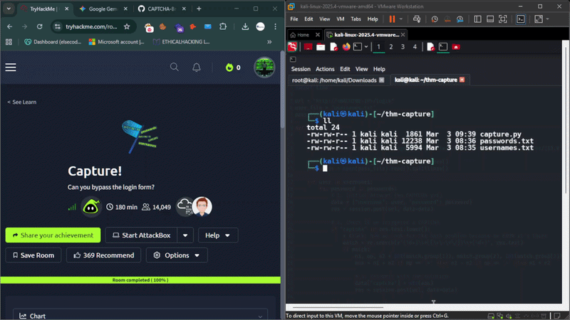

# CAPTCHA-Brute-Force-THM-Capture-Walkthrough
Tryhackme Capture! room Walkthrough, This room For bypass the login form, Using Python Custom Script.
# Briefly explain the problem this tool solves.
Modern web applications use simple math CAPTCHAs to stop automated brute-force attacks. This tool demonstrates how a script can programmatically solve these challenges using Regex and Session management to conduct security audits."

# Installation & Usage
## Must Change the Machine-ip py file.

```git clone https://github.com/Cyb3Raiz000/project-name.git
cd project-name

pip install -r requirements.txt

python3 capture.py
```

# Captcha-Bypass-Pro 🛡️
<div align="center">
  
  <p align="center">
    <b>Figure 1:</b> Automated Configure MACHIN-IP.
  </p>
</div>

<div align="center">
  
  <p align="center">
    <b>Figure 2:</b> Automated SUCCESS Solve The Room with Flag.txt.
  </p>
</div>

## 📖 Overview
Custom Python automation to bypass math-based CAPTCHAs...
